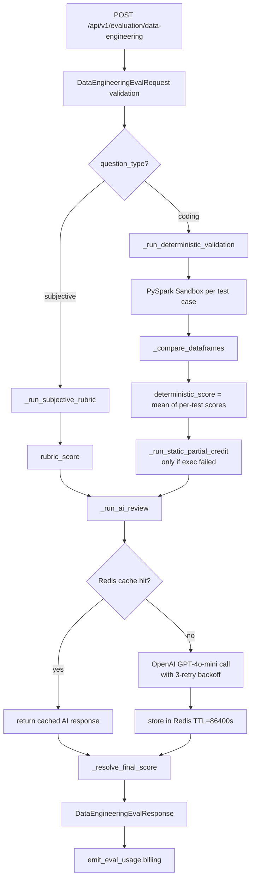
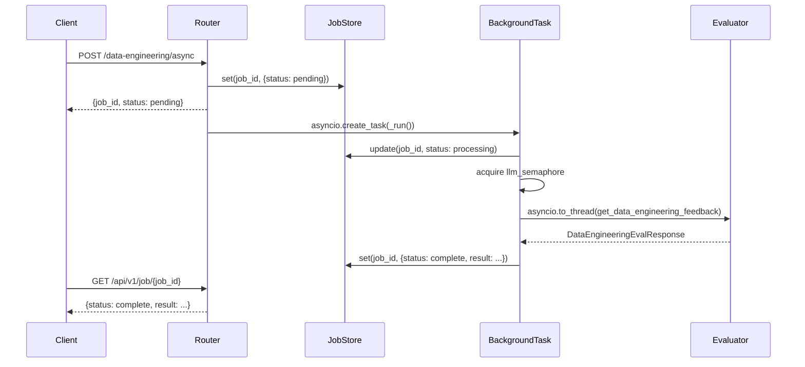

# Design Document: Data Engineering Evaluation

## Overview

This feature adds a Data Engineering competency evaluator to the assessment platform. Candidates submit PySpark code (coding questions) or written answers (subjective questions). The system scores submissions through a 3-layer pipeline:

1. **Deterministic Validation** — PySpark sandbox execution + DataFrame comparison (coding only)
2. **Static Partial Credit** — pattern-matching fallback when execution fails (coding only); or Subjective Rubric Scoring (subjective questions)
3. **AI Review** — GPT-4o-mini qualitative feedback and score (all question types)

A deterministic Score Resolver combines the three layers into a single `final_score`.

Both synchronous (`POST /api/v1/evaluation/data-engineering`) and asynchronous (`POST /api/v1/evaluation/data-engineering/async`) HTTP endpoints are exposed, mirroring the existing SQL and DevOps evaluation patterns. Frontend Next.js proxy routes forward admin UI requests through the standard authenticated proxy.

### Key Difference from Existing Evaluators

All existing evaluators use the local Qwen/vLLM model via `_llm_chat_coder` from `base.py`. The data engineering evaluator uses **GPT-4o-mini via the OpenAI Python client** directly. This requires adding `openai_api_key` and `openai_model` to `ModelSettings`, and the AI review layer uses a **synchronous Redis client** (not the async one in `services/cache.py`) with a **SHA-256 cache key** and **86400s TTL**.

---

## Architecture



### Async Endpoint Flow



---

## Components and Interfaces

### New Files

| File | Purpose |
|------|---------|
| `backend/model_app/competencies/data_engineering/eval_schema.py` | Pydantic request/response models |
| `backend/model_app/evaluation/data_engineering_evaluator.py` | 3-layer evaluator orchestration |

### Modified Files

| File | Change |
|------|--------|
| `backend/model_app/api/routes/evaluation.py` | Add 2 new routes (`/data-engineering`, `/data-engineering/async`) |
| `backend/model_app/core/settings.py` | Add `openai_api_key: str = ""` and `openai_model: str = "gpt-4o-mini"` |
| `frontend/web/app/api/admin/evaluate/data-engineering/route.ts` | New proxy route (sync) |
| `frontend/web/app/api/admin/evaluate/data-engineering-async/route.ts` | New proxy route (async) |
| `frontend/web/lib/endpoints.ts` | Add `evaluate-data-engineering` entry |

### Public Interface: `get_data_engineering_feedback`

```python
def get_data_engineering_feedback(
    *,
    payload: dict,
    usage_meta: dict | None,
) -> dict:
    """
    Main entry point called by the route handler.
    Accepts raw dict payload (validated by Pydantic at route level).
    Returns a DataEngineeringEvalResponse-compatible dict.
    """
```

### Internal Component Interfaces

```python
def _run_deterministic_validation(
    question: dict,
    submission: dict,
) -> dict:
    """
    Executes each test case in the PySpark sandbox and compares DataFrames.
    Returns: {
        deterministic_score: float,
        per_test_case_results: list[dict],
        score_reason: str,
    }
    Only called for question_type == "coding".
    """

def _run_pyspark_sandbox(
    code: str,
    test_case: dict,
    timeout: int = 30,
) -> dict:
    """
    Executes candidate code in an isolated subprocess.
    Returns ExecutionResult-compatible dict.
    """

def _compare_dataframes(
    actual: list[dict],
    expected: list[dict],
) -> dict:
    """
    Compares two DataFrames (as lists of row dicts).
    Returns: {is_correct: bool, deterministic_score: float, score_reason: str}
    """

def _normalize_cell(value: Any) -> Any:
    """
    Normalises a cell value for comparison:
    - None / NaN → None
    - float with no fractional part → int
    - str → stripped
    - bool → bool
    """

def _run_static_partial_credit(
    question: dict,
    submission: dict,
) -> float:
    """
    Pattern-matching partial credit for failed executions.
    Returns static_partial_score in [0, 40].
    Only called when execution status is in the failure set.
    """

def _run_subjective_rubric(
    question: dict,
    submission: dict,
) -> float:
    """
    Deterministic rubric scoring for subjective answers.
    Returns rubric_score in [0, 100].
    Only called for question_type == "subjective".
    """

def _run_ai_review(
    question: dict,
    submission: dict,
    det_results: dict,
    use_cache: bool,
) -> dict:
    """
    GPT-4o-mini AI review with Redis caching.
    Returns AI feedback dict or empty dict on failure.
    """

def _resolve_final_score(
    det_score: float,
    static_score: float,
    ai_score: float | None,
    reason: str,
) -> tuple[float, str]:
    """
    Deterministic score resolution.
    Returns (final_score, resolved_reason).
    """
```

---

## Data Models

### Pydantic Schemas (`eval_schema.py`)

```python
from __future__ import annotations
from typing import Literal
from pydantic import BaseModel

class TestCase(BaseModel):
    input_data: dict = {}
    expected_output: list[dict] = []  # list of row dicts

class ExecutionResult(BaseModel):
    test_case_index: int = 0
    status: Literal["success", "failed", "timeout", "cancelled", "pending", "running"]
    output_df: list[dict] | None = None
    error_message: str | None = None

class DataEngineeringQuestion(BaseModel):
    id: str
    title: str
    description: str = ""
    question_type: Literal["coding", "subjective"]
    difficulty: str = "medium"
    rubric_items: list[str] = []
    test_cases: list[TestCase] = []

class DataEngineeringSubmission(BaseModel):
    code: str = ""           # for coding questions
    answer: str = ""         # for subjective questions
    execution_results: list[ExecutionResult] = []

class DataEngineeringEvalRequest(BaseModel):
    question: DataEngineeringQuestion
    submission: DataEngineeringSubmission
    use_cache: bool = True

class DataEngineeringEvalResponse(BaseModel):
    overall_score: float
    deterministic_score: float
    static_partial_score: float
    ai_score: float | None
    final_score: float
    score_reason: str
    per_test_case_results: list[dict]
    ai_feedback: dict
    is_correct: bool
```

### Score Resolution State

The evaluator maintains intermediate scoring state internally:

| Field | Type | Source |
|-------|------|--------|
| `deterministic_score` | `float` | Mean of per-test-case `_compare_dataframes` scores |
| `static_partial_score` | `float` | `_run_static_partial_credit` output |
| `ai_score` | `float \| None` | `ai_feedback["overall_score"]` or `None` on failure |
| `score_reason` | `str` | Set by whichever layer produced the primary score |
| `final_score` | `float` | Output of `_resolve_final_score` |

### PySpark Sandbox Execution Model

The sandbox runs candidate code in a subprocess using `subprocess.run` with `timeout=30`. The subprocess receives the test case `input_data` via stdin (JSON-encoded) and writes the output DataFrame (as JSON) to stdout. Security import blocking is applied via static analysis of the code string before subprocess launch — any detected import of `os`, `sys`, `subprocess`, `socket`, or `shutil` short-circuits with `status="failed"` and a security violation message.

```python
_BLOCKED_IMPORTS = {"os", "sys", "subprocess", "socket", "shutil"}

_IMPORT_PATTERN = re.compile(
    r"^\s*(?:import\s+([\w,\s]+)|from\s+(\w+)\s+import)",
    re.MULTILINE,
)
```

### Static Partial Credit Patterns

```python
_PATTERNS: dict[str, str] = {
    "spark_session":   r"SparkSession|spark\.builder",
    "data_reading":    r"\.read\b|\.csv\b|\.parquet\b|\.json\b",
    "schema_cast":     r"\.schema\b|\.cast\b|StructType|StructField",
    "null_handling":   r"fillna|dropna|isNull",
    "transformations": r"withColumn|\.when\b|otherwise",
    "aggregations":    r"groupBy|\.agg\b|\.count\b|\.sum\b",
    "spark_sql":       r"spark\.sql|createOrReplaceTempView",
    "write_ops":       r"\.write\b|\.save\b|\.saveAsTable",
}
# 3 pts each → max 24 pts
# + rubric token overlap: 0.6 pts per token, max 12 pts
# + length bonus: 40+ unique tokens=4pts, 20+=2pts, else 0
# Total max: 40 pts
```

### Subjective Rubric Reasoning Terms

```python
_REASONING_TERMS = {
    "because", "tradeoff", "latency", "throughput", "schema", "quality",
    "monitoring", "partitioning", "checkpoint", "deduplicate", "watermark",
    "backfill", "rollback", "governance", "lineage",
}
```

### Redis Cache Key Construction

```python
import hashlib

def _build_cache_key(code_or_answer: str, question_id: str, validation_signature: str) -> str:
    raw = f"{code_or_answer}{question_id}{validation_signature}"
    return hashlib.sha256(raw.encode()).hexdigest()

def _build_validation_signature(question: dict) -> str:
    """Deterministic string from expected output schema + row count across all test cases."""
    parts = []
    for tc in question.get("test_cases", []):
        expected = tc.get("expected_output", [])
        cols = sorted(expected[0].keys()) if expected else []
        parts.append(f"{cols}:{len(expected)}")
    return "|".join(parts)
```

### Settings Additions

```python
# In ModelSettings (backend/model_app/core/settings.py):
openai_api_key: str = ""
openai_model: str = "gpt-4o-mini"
```

### AI Review Response Shape

```python
{
    "overall_score": float,           # 0–100
    "correctness_feedback": str,
    "performance_feedback": str,
    "best_practices_feedback": str,
    "improvement_suggestions": list[str],
    "strengths": list[str],
    "areas_for_improvement": list[str],
    "code_examples": list,
    "alternative_approaches": list,
}
```

---

## Correctness Properties

*A property is a characteristic or behavior that should hold true across all valid executions of a system — essentially, a formal statement about what the system should do. Properties serve as the bridge between human-readable specifications and machine-verifiable correctness guarantees.*

This feature is well-suited for property-based testing. The core components — DataFrame comparison, cell normalisation, static partial credit scoring, subjective rubric scoring, and score resolution — are all pure functions with clear input/output behavior and large input spaces where varied inputs reveal edge cases.

**Property reflection:** After reviewing all testable criteria, several properties are consolidated:
- Score cap properties (3.4, 3.5, 3.6) are unified into a single DataFrame comparison score cap property.
- Rubric scoring component properties (5.2–5.6) are unified into a single rubric component bounds property.
- Score resolution properties (7.1–7.5) are unified into a single resolution invariant property.
- Penalty rules (5.7–5.12) are unified into a single penalty property.

---

### Property 1: Schema validation round-trip

*For any* dict that can be constructed as a valid `DataEngineeringEvalRequest`, serialising it via `model_dump()` and re-parsing it with `DataEngineeringEvalRequest.model_validate()` SHALL produce an equivalent model instance.

**Validates: Requirements 1.1, 1.2**

---

### Property 2: Invalid question_type is always rejected

*For any* string value that is not `"coding"` or `"subjective"`, constructing a `DataEngineeringEvalRequest` with that `question_type` SHALL raise a `ValidationError`.

**Validates: Requirements 1.4**

---

### Property 3: Cell normalisation produces stable equivalences

*For any* pair of cell values `(a, b)` that are semantically equivalent under the normalisation rules (`None`/`NaN` → `None`; `float` with no fractional part → `int`; `str` → stripped; `bool` → `bool`), `_normalize_cell(a) == _normalize_cell(b)` SHALL hold.

**Validates: Requirements 3.2**

---

### Property 4: DataFrame comparison score caps are respected

*For any* pair of DataFrames `(actual, expected)`, the `deterministic_score` returned by `_compare_dataframes` SHALL satisfy:
- If schema does not match: `deterministic_score <= 40`
- If schema matches but row count does not: `deterministic_score <= 60`
- If schema and row count match but data does not: `deterministic_score <= 85`
- If all match: `deterministic_score == 100`

**Validates: Requirements 3.3, 3.4, 3.5, 3.6**

---

### Property 5: Multi-test-case deterministic score is the arithmetic mean

*For any* coding question with N test cases (N ≥ 1), the overall `deterministic_score` SHALL equal the arithmetic mean of the N per-test-case `deterministic_score` values.

**Validates: Requirements 3.7**

---

### Property 6: Static partial credit is bounded in [0, 40]

*For any* code submission and question, `_run_static_partial_credit` SHALL return a value in the closed interval `[0, 40]`.

**Validates: Requirements 4.5**

---

### Property 7: Static pattern score is proportional to matched patterns

*For any* code submission containing exactly K of the 8 defined patterns (K ∈ {0, …, 8}), the pattern hit contribution to `static_partial_score` SHALL equal `min(3 * K, 24)`.

**Validates: Requirements 4.2**

---

### Property 8: Rubric component scores are within their declared maxima

*For any* subjective answer and question, each component of the rubric score SHALL satisfy:
- `coverage_score ∈ [0, 55]`
- `concept_score ∈ [0, 15]`
- `depth_score ∈ [0, 15]`
- `structure_score ∈ {3, 7, 10}`
- `reasoning_score ∈ [0, 10]`
- `total_rubric_score ∈ [0, 100]`

**Validates: Requirements 5.1, 5.2, 5.3, 5.4, 5.5, 5.6**

---

### Property 9: Rubric penalty rules are applied correctly

*For any* subjective answer, the penalty rules SHALL be applied in order such that:
- If `word_count < 20`: `rubric_score <= 10`
- If `20 <= word_count < 40`: `rubric_score <= pre_penalty_score * 0.45`
- If `40 <= word_count < 70`: `rubric_score <= pre_penalty_score * 0.70`
- If copy-paste detected (similarity ≥ 88%, novel tokens < 25%): `rubric_score <= 8`
- If near-copy detected (similarity ≥ 75%, novel tokens < 35%): `rubric_score <= 22`
- If `coverage_ratio < 0.25`: `rubric_score <= 35`

**Validates: Requirements 5.7, 5.8, 5.9, 5.10, 5.11, 5.12**

---

### Property 10: Security import blocking covers all blocked modules

*For any* code string containing an import of any module in `{"os", "sys", "subprocess", "socket", "shutil"}` (including `import X`, `from X import Y`, and aliased forms), the sandbox SHALL return `status = "failed"` with a security violation message.

**Validates: Requirements 2.5**

---

### Property 11: Final score is always clamped to [0, 100]

*For any* combination of `det_score`, `static_score`, and `ai_score` inputs to `_resolve_final_score`, the returned `final_score` SHALL satisfy `0.0 <= final_score <= 100.0`.

**Validates: Requirements 7.4**

---

### Property 12: Score resolution follows the deterministic override rules

*For any* inputs to `_resolve_final_score`:
- Default: `final_score == det_score` when no override condition applies
- AI fallback: `final_score == ai_score` when `reason ∈ FALLBACK_REASONS` AND `det_score == 0` AND `ai_score is not None`
- Static override: `final_score == static_score` when `static_score > ai_score` (and `ai_score is not None`)
- `score_reason` is always a non-empty string

**Validates: Requirements 7.1, 7.2, 7.3, 7.5**

---

## Error Handling

### PySpark Sandbox

| Failure Mode | Handling |
|---|---|
| Subprocess timeout | `SIGKILL` the process; return `status="timeout"`, `output_df=None` |
| Unhandled exception in candidate code | Capture traceback; return `status="failed"`, `error_message=traceback[:2000]` |
| Security import detected | Short-circuit before subprocess launch; return `status="failed"`, `error_message="Security violation: import of <module> is not allowed"` |
| Subprocess output not valid JSON | Return `status="failed"`, `error_message="Output parse error: ..."` |

### AI Review (GPT-4o-mini)

| Failure Mode | Handling |
|---|---|
| OpenAI API error (first call) | Retry with exponential backoff (1s, 2s, 4s); max 3 retries |
| All retries exhausted | Return `ai_score=None`, empty `ai_feedback`; log WARNING |
| Response not valid JSON | Attempt `safe_parse`; on failure return `ai_score=None` |
| Redis connection unavailable | Log WARNING; proceed without caching; do not raise |
| Redis get failure | Log WARNING; treat as cache miss; continue |
| Redis set failure | Log WARNING; result is still returned to caller |

### Score Resolution

| Failure Mode | Handling |
|---|---|
| `ai_score` is `None` | Skip AI fallback and static override checks; use deterministic score |
| All scores are 0 | Return `final_score=0`, `score_reason="no_score_available"` |
| `final_score` out of range | Clamp to `[0, 100]` |

### Billing

`emit_eval_usage` is always called, even on failure paths, to ensure every request is tracked. On AI failure, `status="error"` and `error_detail` are passed. On cache hit, `cache_hit=True` and `latency_ms=0` are passed.

---

## Testing Strategy

### Unit Tests (example-based)

Focus on specific behaviors and integration points:

- `TestCase` / `ExecutionResult` / `DataEngineeringEvalRequest` / `DataEngineeringEvalResponse` schema validation with valid and invalid inputs
- `_normalize_cell` with concrete examples: `None`, `float('nan')`, `3.0`, `" foo "`, `True`
- `_compare_dataframes` with concrete identical, schema-mismatch, row-count-mismatch, and data-mismatch DataFrames
- `_run_static_partial_credit` with code containing 0, 4, and 8 patterns
- `_run_subjective_rubric` with a short answer (< 20 words), a copy-paste answer, and a well-structured answer
- `_run_ai_review` with mocked OpenAI client: verify correct parameters, retry on failure, cache hit skips API call
- `_resolve_final_score` with each of the three resolution paths
- Route handler: FastAPI `TestClient` for HTTP 200 on valid request, HTTP 422 on missing fields
- Async route handler: verify `job_id` returned immediately and job store updated

### Property-Based Tests

Use **Hypothesis** (Python) as the PBT library. Each property test runs a minimum of **100 iterations**.

Tag format: `# Feature: data-engineering-evaluation, Property {N}: {property_text}`

| Property | Test Description | Key Generators |
|---|---|---|
| P1: Schema round-trip | Generate valid request dicts, verify round-trip | `st.fixed_dictionaries` with valid field values |
| P2: Invalid question_type rejected | Generate arbitrary strings ≠ {"coding","subjective"} | `st.text().filter(lambda s: s not in {...})` |
| P3: Cell normalisation equivalences | Generate semantically-equal value pairs | Custom strategy for each normalisation rule |
| P4: DataFrame score caps | Generate DataFrame pairs with controlled mismatch types | `st.lists(st.fixed_dictionaries(...))` |
| P5: Multi-test-case mean | Generate lists of per-test-case scores | `st.lists(st.floats(0, 100), min_size=1)` |
| P6: Static score bounded [0,40] | Generate arbitrary code strings and questions | `st.text()`, `st.lists(st.text())` |
| P7: Pattern score proportional | Generate code with exactly K of 8 patterns | Compose code from pattern snippets |
| P8: Rubric component bounds | Generate arbitrary answers and rubric items | `st.text()`, `st.lists(st.text())` |
| P9: Penalty rules applied | Generate answers with controlled word counts and similarity | Custom strategy for word count and similarity |
| P10: Security import blocking | Generate code with imports of blocked modules | `st.sampled_from(_BLOCKED_IMPORTS)` |
| P11: Final score clamped | Generate arbitrary float triples | `st.floats(-200, 200)` |
| P12: Score resolution rules | Generate inputs matching each resolution condition | `st.sampled_from(FALLBACK_REASONS)` |

### Integration Tests

- End-to-end sync endpoint with a real (or Docker-based) PySpark environment
- Redis cache integration: verify TTL=86400 and SHA-256 key format
- OpenAI retry behavior with a mock server that returns errors N times
- Billing: verify `emit_eval_usage` is called with correct `route="data_engineering_evaluation"`

### Test File Locations

```
backend/tests/evaluation/
  test_data_engineering_schema.py       # P1, P2, unit schema tests
  test_data_engineering_comparator.py   # P3, P4, P5, unit comparator tests
  test_data_engineering_static.py       # P6, P7, unit static scorer tests
  test_data_engineering_rubric.py       # P8, P9, unit rubric scorer tests
  test_data_engineering_sandbox.py      # P10, unit sandbox tests
  test_data_engineering_resolver.py     # P11, P12, unit resolver tests
  test_data_engineering_ai_review.py    # unit AI review tests (mocked OpenAI)
  test_data_engineering_routes.py       # integration route tests
```
