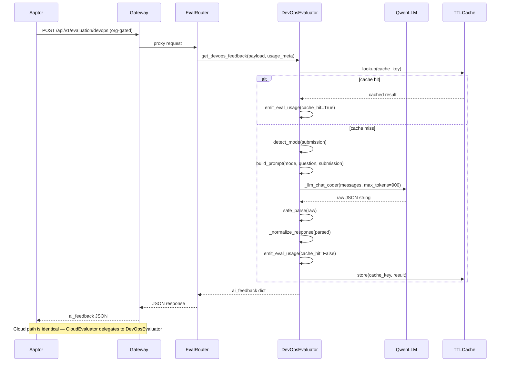

# Design Document: DevOps / Cloud Evaluation

## Overview

This feature replaces Aaptor's OpenAI-based DevOps and Cloud evaluators with Qwen-based equivalents running on the local model service. Two new FastAPI endpoints — `POST /api/v1/evaluation/devops` and `POST /api/v1/evaluation/cloud` — accept a question object and candidate submission, then return a structured `ai_feedback` response that is byte-for-byte compatible with Aaptor's existing contract.

The design follows the established `sql_evaluator.py` pattern: TTLCache, `safe_parse`, `emit_eval_usage`, and a deterministic fallback. The Cloud evaluator is a thin wrapper that delegates entirely to the DevOps evaluator, differing only in the billing route name.

Key design decisions:
- **Mode auto-detection**: terminal mode when `terminal_history` is non-empty or `engine_response.exit_code` is non-null; scenario mode otherwise.
- **Derived tasks**: the LLM derives 3–7 concrete tasks from the question and marks each `completed: true/false`; `overall_score = round((completed / total) * 100)`.
- **1024-token context budget**: prompts are structured to fit within Qwen's context limit by capping field lengths and using concise system prompts.
- **No downstream changes**: the response shape exactly matches Aaptor's `ai_feedback` contract.

---

## Architecture



### Component Relationships

```
backend/gateway/main.py          ← adds evaluation/devops + evaluation/cloud to _ORG_GATED_POST_PATHS
backend/model_app/api/routes/evaluation.py  ← adds /devops and /cloud route handlers
backend/model_app/evaluation/devops_evaluator.py  ← core evaluation logic
backend/model_app/evaluation/cloud_evaluator.py   ← thin wrapper, delegates to devops_evaluator
backend/model_app/competencies/devops/eval_schema.py  ← Pydantic request models
frontend/web/app/api/admin/evaluate/devops/route.ts  ← Next.js proxy
frontend/web/app/api/admin/evaluate/cloud/route.ts   ← Next.js proxy
```

---

## Components and Interfaces

### Pydantic Request Models (`backend/model_app/competencies/devops/eval_schema.py`)

```python
from __future__ import annotations
from typing import Optional
from pydantic import BaseModel, Field


class EngineResponse(BaseModel):
    exit_code: Optional[int] = None
    stdout: str = ""
    stderr: str = ""


class ValidationSignals(BaseModel):
    passed: bool = False
    question_score: Optional[int] = None
    max_score: Optional[int] = None
    reasons: list[str] = Field(default_factory=list)


class TerminalHistoryEntry(BaseModel):
    command: str = ""
    output: str = ""


class DevOpsQuestion(BaseModel):
    id: str
    title: str
    description: str = ""
    kind: str = ""                          # "code" | "scenario"
    difficulty: str = ""
    instructions: str = ""
    constraints: list[str] = Field(default_factory=list)
    hints: list[str] = Field(default_factory=list)
    expected_submission_contains: list[str] = Field(default_factory=list)
    expected_exit_code: Optional[int] = None
    expected_stdout_contains: list[str] = Field(default_factory=list)
    forbidden_stderr_regex: Optional[str] = None


class DevOpsSubmission(BaseModel):
    answer: str = ""
    terminal_history: list[TerminalHistoryEntry] = Field(default_factory=list)
    outputs: list[str] = Field(default_factory=list)
    engine_response: Optional[EngineResponse] = None
    validation_signals: Optional[ValidationSignals] = None


class DevOpsEvalRequest(BaseModel):
    question: DevOpsQuestion
    submission: DevOpsSubmission
    use_cache: bool = True


class CloudEvalRequest(BaseModel):
    """Identical fields to DevOpsEvalRequest; kept as a separate model for
    schema clarity and future divergence."""
    question: DevOpsQuestion
    submission: DevOpsSubmission
    use_cache: bool = True
```

### DevOps Evaluator Public Interface (`backend/model_app/evaluation/devops_evaluator.py`)

```python
def get_devops_feedback(
    *,
    payload: dict,
    usage_meta: dict | None,
    route: str = "devops_evaluation",
) -> dict:
    """
    Main entry point. Accepts raw dict (validated by Pydantic at route level).
    Returns ai_feedback dict matching the Aaptor contract.
    route parameter allows Cloud_Evaluator to pass "cloud_evaluation" for billing.
    """
```

### Cloud Evaluator Public Interface (`backend/model_app/evaluation/cloud_evaluator.py`)

```python
def get_cloud_feedback(
    *,
    payload: dict,
    usage_meta: dict | None,
) -> dict:
    """Thin wrapper — delegates entirely to get_devops_feedback."""
    from backend.model_app.evaluation.devops_evaluator import get_devops_feedback
    return get_devops_feedback(payload=payload, usage_meta=usage_meta, route="cloud_evaluation")
```

### Route Handlers (`backend/model_app/api/routes/evaluation.py` additions)

```python
@router.post("/devops")
async def evaluate_devops(
    http_request: Request,
    payload: DevOpsEvalRequest,
) -> dict:
    usage_meta = bind_usage_meta_from_request(http_request)
    return get_devops_feedback(payload=payload.model_dump(), usage_meta=usage_meta)


@router.post("/cloud")
async def evaluate_cloud(
    http_request: Request,
    payload: CloudEvalRequest,
) -> dict:
    usage_meta = bind_usage_meta_from_request(http_request)
    return get_cloud_feedback(payload=payload.model_dump(), usage_meta=usage_meta)
```

### Frontend Proxy Routes

`frontend/web/app/api/admin/evaluate/devops/route.ts`:
```typescript
import { makeAdminProxyPost } from "@/lib/proxyUtils";
export const POST = makeAdminProxyPost("/api/v1/evaluation/devops");
```

`frontend/web/app/api/admin/evaluate/cloud/route.ts`:
```typescript
import { makeAdminProxyPost } from "@/lib/proxyUtils";
export const POST = makeAdminProxyPost("/api/v1/evaluation/cloud");
```

---

## Data Models

### Response Contract (`ai_feedback`)

The response must match Aaptor's existing shape exactly. Every field must be present; missing LLM fields are substituted with safe defaults.

```python
def _empty_response() -> dict:
    return {
        "overall_score": 0,
        "feedback_summary": "",
        "one_liner": "",
        "code_quality":    {"score": 0, "comments": ""},
        "correctness":     {"score": 0, "comments": ""},
        "library_usage":   {"score": 0, "comments": ""},
        "output_quality":  {"score": 0, "comments": ""},
        "task_completion": {
            "score": 0,
            "comments": "",
            "completed": 0,
            "total": 0,
            "details": [],
        },
        "strengths":              [],
        "areas_for_improvement":  [],
        "suggestions":            [],
        "improvement_suggestions": [],
        "deduction_reasons":      [],
        "derived_tasks":          [],
        "ideal_answer_summary":   "",
        "ai_generated":           True,
    }
```

### `derived_tasks` item shape

```python
{
    "task":      str,   # concise task description
    "score":     int,   # round(100 / total) if completed else 0
    "completed": bool,
    "evidence":  str,   # what in the submission supports this verdict
    "reasoning": str,   # brief explanation
}
```

### Scoring Formula

```python
def _compute_scores(derived_tasks: list[dict]) -> tuple[int, int, int]:
    """Returns (overall_score, completed_count, total_count)."""
    total = len(derived_tasks)
    if total == 0:
        return 0, 0, 0
    completed = sum(1 for t in derived_tasks if t.get("completed", False))
    overall_score = round((completed / total) * 100)
    per_task_score = round(100 / total)
    for t in derived_tasks:
        t["score"] = per_task_score if t.get("completed", False) else 0
    return overall_score, completed, total
```

### Cache Key

```python
import hashlib, json

def _cache_key(question_id: str, submission: dict) -> str:
    payload = f"{question_id}:{json.dumps(submission, sort_keys=True, default=str)}"
    return hashlib.md5(payload.encode()).hexdigest()
```

---

## Qwen Prompts

### System Prompt — Terminal Mode

Designed to fit within the 1024-token context budget. The system prompt is kept under ~300 tokens; the user prompt is capped to leave room for the 900-token completion.

```
You are a strict DevOps/Cloud submission evaluator.

Analyse the candidate's terminal commands and outputs against the question requirements.
Derive exactly 3 to 7 concrete, verifiable tasks from the question.
For each task, decide completed: true or false based on execution evidence.
Use validation_signals.passed and validation_signals.reasons as supporting evidence only.

Return ONLY valid JSON — no markdown, no code fences, no explanation:
{
  "derived_tasks": [
    {
      "task": "<concise task description>",
      "completed": <true|false>,
      "evidence": "<what in the submission supports this verdict>",
      "reasoning": "<1 sentence>"
    }
  ],
  "feedback_summary": "<2-3 sentences on overall performance>",
  "one_liner": "<single sentence verdict>",
  "ideal_answer_summary": "<what a perfect submission would look like>",
  "strengths": ["<strength>"],
  "areas_for_improvement": ["<area>"],
  "suggestions": ["<suggestion>"],
  "deduction_reasons": ["<reason score was reduced>"]
}

Rules:
- Derive between 3 and 7 tasks. Never fewer, never more.
- Base task completion strictly on execution evidence in terminal_history and engine_response.
- If terminal_history is empty, mark all tasks incomplete.
- Do not invent evidence. If unsure, mark incomplete.
- Keep each string under 120 characters.
- Max 3 items per list field.
```

### System Prompt — Scenario Mode

```
You are a strict DevOps/Cloud written-answer evaluator.

Analyse the candidate's written answer against the question requirements.
Derive exactly 3 to 7 concrete, verifiable tasks from the question.
For each task, decide completed: true or false based on the written answer.
Use question instructions, hints, and constraints as the evaluation rubric.

Return ONLY valid JSON — no markdown, no code fences, no explanation:
{
  "derived_tasks": [
    {
      "task": "<concise task description>",
      "completed": <true|false>,
      "evidence": "<quote or paraphrase from the answer that supports this verdict>",
      "reasoning": "<1 sentence>"
    }
  ],
  "feedback_summary": "<2-3 sentences on overall performance>",
  "one_liner": "<single sentence verdict>",
  "ideal_answer_summary": "<what a perfect answer would cover>",
  "strengths": ["<strength>"],
  "areas_for_improvement": ["<area>"],
  "suggestions": ["<suggestion>"],
  "deduction_reasons": ["<reason score was reduced>"]
}

Rules:
- Derive between 3 and 7 tasks. Never fewer, never more.
- If the answer is empty or fewer than 20 characters, mark all tasks incomplete.
- Do not invent evidence. If unsure, mark incomplete.
- Keep each string under 120 characters.
- Max 3 items per list field.
```

### User Prompt Template — Terminal Mode

```python
def _build_terminal_user_prompt(question: dict, submission: dict) -> str:
    q = question
    s = submission
    vs = s.get("validation_signals") or {}
    er = s.get("engine_response") or {}

    # Cap terminal history to last 10 entries, each output capped at 300 chars
    history = s.get("terminal_history") or []
    history_lines = []
    for entry in history[-10:]:
        cmd = str(entry.get("command") or "")
        out = str(entry.get("output") or "")[:300]
        history_lines.append(f"$ {cmd}\n{out}")
    history_block = "\n".join(history_lines) or "(empty)"

    return (
        f"question_id: {q.get('id', '')}\n"
        f"title: {q.get('title', '')}\n"
        f"description: {str(q.get('description', ''))[:600]}\n"
        f"instructions: {str(q.get('instructions', ''))[:400]}\n"
        f"constraints: {q.get('constraints', [])}\n"
        f"expected_submission_contains: {q.get('expected_submission_contains', [])}\n"
        f"expected_exit_code: {q.get('expected_exit_code')}\n\n"
        f"terminal_history (last 10 commands):\n{history_block}\n\n"
        f"engine_response:\n"
        f"  exit_code: {er.get('exit_code')}\n"
        f"  stdout: {str(er.get('stdout', ''))[:300]}\n"
        f"  stderr: {str(er.get('stderr', ''))[:200]}\n\n"
        f"validation_signals:\n"
        f"  passed: {vs.get('passed', False)}\n"
        f"  question_score: {vs.get('question_score')}\n"
        f"  max_score: {vs.get('max_score')}\n"
        f"  reasons: {vs.get('reasons', [])}\n\n"
        f"Return ONLY the JSON described in the system prompt."
    )
```

### User Prompt Template — Scenario Mode

```python
def _build_scenario_user_prompt(question: dict, submission: dict) -> str:
    q = question
    s = submission
    vs = s.get("validation_signals") or {}
    answer = str(s.get("answer") or "")[:1500]

    return (
        f"question_id: {q.get('id', '')}\n"
        f"title: {q.get('title', '')}\n"
        f"description: {str(q.get('description', ''))[:600]}\n"
        f"instructions: {str(q.get('instructions', ''))[:400]}\n"
        f"constraints: {q.get('constraints', [])}\n"
        f"hints: {q.get('hints', [])}\n\n"
        f"candidate_answer:\n{answer}\n\n"
        f"validation_signals:\n"
        f"  passed: {vs.get('passed', False)}\n"
        f"  reasons: {vs.get('reasons', [])}\n\n"
        f"Return ONLY the JSON described in the system prompt."
    )
```

---

## Mode Detection

```python
def _detect_mode(submission: dict) -> str:
    """Returns "terminal" or "scenario"."""
    history = submission.get("terminal_history") or []
    er = submission.get("engine_response") or {}
    if (isinstance(history, list) and len(history) > 0) or er.get("exit_code") is not None:
        return "terminal"
    return "scenario"
```

---

## Response Normalization

The `_normalize_response` function maps Qwen's raw output to the full `ai_feedback` contract. It never raises — every field has a safe default.

```python
def _normalize_response(raw: dict, validation_signals: dict | None) -> dict:
    base = _empty_response()
    if not isinstance(raw, dict) or raw.get("parse_error"):
        return base

    def _str(v, max_len: int = 500) -> str:
        return str(v)[:max_len] if v is not None else ""

    def _list_of_str(v, max_items: int = 3) -> list[str]:
        if not isinstance(v, list):
            return []
        return [str(x) for x in v[:max_items] if str(x).strip()]

    def _int_clamp(v, lo: int = 0, hi: int = 100) -> int:
        try:
            return max(lo, min(hi, int(v)))
        except Exception:
            return lo

    # Derived tasks — the source of truth for scoring
    raw_tasks = raw.get("derived_tasks") or []
    derived_tasks: list[dict] = []
    if isinstance(raw_tasks, list):
        for t in raw_tasks:
            if not isinstance(t, dict):
                continue
            derived_tasks.append({
                "task":      _str(t.get("task"), 200),
                "score":     0,   # filled in by _compute_scores
                "completed": bool(t.get("completed", False)),
                "evidence":  _str(t.get("evidence"), 300),
                "reasoning": _str(t.get("reasoning"), 200),
            })

    overall_score, completed_count, total_count = _compute_scores(derived_tasks)
    base["derived_tasks"] = derived_tasks
    base["overall_score"] = overall_score

    # task_completion mirrors the scoring
    base["task_completion"] = {
        "score":     overall_score,
        "comments":  _str(raw.get("feedback_summary"), 300),
        "completed": completed_count,
        "total":     total_count,
        "details":   [t["task"] for t in derived_tasks if t["completed"]],
    }

    # Narrative fields
    base["feedback_summary"]     = _str(raw.get("feedback_summary"), 500)
    base["one_liner"]            = _str(raw.get("one_liner"), 200)
    base["ideal_answer_summary"] = _str(raw.get("ideal_answer_summary"), 500)

    # List fields
    base["strengths"]              = _list_of_str(raw.get("strengths"))
    base["areas_for_improvement"]  = _list_of_str(raw.get("areas_for_improvement"))
    base["suggestions"]            = _list_of_str(raw.get("suggestions"))
    base["improvement_suggestions"] = _list_of_str(raw.get("improvement_suggestions"))
    base["deduction_reasons"]      = _list_of_str(raw.get("deduction_reasons"))

    # Scored sub-objects — LLM may or may not provide these; default to 0
    for key in ("code_quality", "correctness", "library_usage", "output_quality"):
        raw_sub = raw.get(key)
        if isinstance(raw_sub, dict):
            base[key] = {
                "score":    _int_clamp(raw_sub.get("score", 0)),
                "comments": _str(raw_sub.get("comments", ""), 300),
            }

    base["ai_generated"] = True
    return base
```

---

## Fallback Response

Returned when Qwen raises an exception or `safe_parse` returns `parse_error: True`.

```python
def _fallback_response(validation_signals: dict | None) -> dict:
    vs = validation_signals or {}
    score = int(vs.get("question_score") or 0)
    base = _empty_response()
    base["overall_score"]    = score
    base["feedback_summary"] = "Automated scoring applied. Human review recommended."
    base["one_liner"]        = "Evaluation unavailable."
    base["task_completion"]["score"] = score
    base["ai_generated"] = True
    return base
```

---

## Gateway Org-Gating

In `backend/gateway/main.py`, add the two new paths to `_ORG_GATED_POST_PATHS`:

```python
_ORG_GATED_POST_PATHS = frozenset(
    {
        # ... existing paths ...
        "/api/v1/evaluation/devops",   # ← add
        "/api/v1/evaluation/cloud",    # ← add
    }
)
```

This ensures both endpoints require a verified org (or admin API key) when `REQUIRE_VERIFIED_ORG_FOR_GENERATION=true`, consistent with all other evaluation endpoints.

---

## Correctness Properties

*A property is a characteristic or behavior that should hold true across all valid executions of a system — essentially, a formal statement about what the system should do. Properties serve as the bridge between human-readable specifications and machine-verifiable correctness guarantees.*

### Property 1: Response contract completeness

*For any* valid `DevOpsEvalRequest` payload (terminal mode or scenario mode), the response returned by `get_devops_feedback` SHALL contain all required top-level keys (`overall_score`, `feedback_summary`, `one_liner`, `code_quality`, `correctness`, `library_usage`, `output_quality`, `task_completion`, `strengths`, `areas_for_improvement`, `suggestions`, `improvement_suggestions`, `deduction_reasons`, `derived_tasks`, `ideal_answer_summary`, `ai_generated`) with the correct types, and `ai_generated` SHALL always be `True`.

**Validates: Requirements 1.2, 1.6, 6.1, 6.2, 6.3, 6.4, 6.5**

### Property 2: Normalization never raises

*For any* dict (including empty dict, partially populated dict, or dict with wrong value types) passed to `_normalize_response`, the function SHALL return a dict containing all required keys without raising an exception.

**Validates: Requirements 6.6**

### Property 3: Scoring formula correctness

*For any* list of derived tasks where each task has a `completed` boolean, `overall_score` SHALL equal `round((completed_count / total_count) * 100)`, each completed task's `score` SHALL equal `round(100 / total_count)`, each incomplete task's `score` SHALL be `0`, and `task_completion.score` SHALL equal `overall_score`. When the list is empty, `overall_score` SHALL be `0`.

**Validates: Requirements 7.1, 7.2, 7.3, 7.4**

### Property 4: Mode detection correctness

*For any* submission dict, `_detect_mode` SHALL return `"terminal"` if and only if `terminal_history` is a non-empty list or `engine_response.exit_code` is not `None`; otherwise it SHALL return `"scenario"`.

**Validates: Requirements 3.1, 3.2, 3.3**

### Property 5: Cloud evaluator delegation

*For any* valid payload, `get_cloud_feedback(payload)` SHALL return the same result as `get_devops_feedback(payload, route="cloud_evaluation")` — the cloud evaluator introduces no independent scoring logic.

**Validates: Requirements 2.2, 2.3**

### Property 6: Fallback on LLM failure

*For any* exception raised by the LLM call, `get_devops_feedback` SHALL return a dict (not raise) that contains all required top-level keys.

**Validates: Requirements 9.1**

---

## Error Handling

| Failure scenario | Behaviour |
|---|---|
| Qwen raises any exception | Catch, log at WARNING, call `emit_eval_usage(status="error")`, return `_fallback_response` |
| `safe_parse` returns `parse_error: True` | Treat as failure — return `_fallback_response` |
| `derived_tasks` list is empty or absent | `_compute_scores` returns `(0, 0, 0)`; `overall_score = 0` |
| `derived_tasks` count outside 3–7 | Accept whatever the LLM returns; scoring formula still applies |
| `validation_signals` absent | `vs = {}` throughout; `question_score` defaults to 0 in fallback |
| Submission is empty (no answer, no history) | Short-circuit before LLM call; return `_empty_response()` |
| Cache serialisation error | Log and skip cache write; proceed normally |

All exceptions from the LLM layer are caught at the top of `get_devops_feedback`. The function is guaranteed to return a dict.

---

## Testing Strategy

### Unit Tests (example-based)

- Pydantic model validation: valid and invalid `DevOpsEvalRequest` / `CloudEvalRequest` payloads.
- Mode detection: terminal history present, engine_response exit_code present, both absent.
- Prompt construction: verify terminal and scenario user prompts include required fields.
- Cache hit: second call with same payload returns cached result; `emit_eval_usage` called with `cache_hit=True`.
- Cache bypass: `use_cache=False` always calls LLM.
- Fallback content: `feedback_summary` equals the expected string; `overall_score` from `validation_signals.question_score`.
- Billing route names: `devops_evaluation` for DevOps, `cloud_evaluation` for Cloud.
- Gateway paths: `_ORG_GATED_POST_PATHS` contains both new paths.

### Property-Based Tests

Using [Hypothesis](https://hypothesis.readthedocs.io/) (Python). Each test runs a minimum of 100 iterations.

**Property 1 — Response contract completeness**
Tag: `Feature: devops-cloud-evaluation, Property 1: response contract completeness`
- Strategy: generate random `DevOpsEvalRequest`-shaped dicts (varying question fields, submission fields, terminal history length 0–15, answer length 0–2000).
- Mock `_llm_chat_coder` to return a valid JSON string with a random subset of fields.
- Assert all required keys present, correct types, `ai_generated == True`.

**Property 2 — Normalization never raises**
Tag: `Feature: devops-cloud-evaluation, Property 2: normalization never raises`
- Strategy: generate arbitrary dicts using `hypothesis.strategies.dictionaries`.
- Call `_normalize_response(raw, validation_signals=None)` directly.
- Assert no exception raised and result is a dict with all required keys.

**Property 3 — Scoring formula correctness**
Tag: `Feature: devops-cloud-evaluation, Property 3: scoring formula correctness`
- Strategy: generate lists of 0–10 task dicts with random `completed` booleans.
- Call `_compute_scores(tasks)` directly.
- Assert `overall_score == round((completed/total)*100)` (or 0 when total==0).
- Assert per-task scores match formula.
- Assert `task_completion.score == overall_score` via `_normalize_response`.

**Property 4 — Mode detection correctness**
Tag: `Feature: devops-cloud-evaluation, Property 4: mode detection correctness`
- Strategy: generate submission dicts with varying `terminal_history` (empty list, non-empty list, absent) and `engine_response` (None, `{exit_code: None}`, `{exit_code: 0}`).
- Call `_detect_mode(submission)` directly.
- Assert return value matches the specification.

**Property 5 — Cloud evaluator delegation**
Tag: `Feature: devops-cloud-evaluation, Property 5: cloud evaluator delegation`
- Strategy: generate random valid payloads.
- Mock `get_devops_feedback` to record calls and return a fixed result.
- Call `get_cloud_feedback(payload)`.
- Assert `get_devops_feedback` was called exactly once with `route="cloud_evaluation"` and the same payload.

**Property 6 — Fallback on LLM failure**
Tag: `Feature: devops-cloud-evaluation, Property 6: fallback on LLM failure`
- Strategy: generate random valid payloads; mock `_llm_chat_coder` to raise a random exception from a set (ValueError, RuntimeError, TimeoutError, OSError).
- Call `get_devops_feedback(payload, usage_meta=None)`.
- Assert no exception raised and result is a dict with all required keys.

### Integration Tests

- End-to-end: POST to `/api/v1/evaluation/devops` with a real terminal-mode payload; verify HTTP 200 and response shape.
- End-to-end: POST to `/api/v1/evaluation/cloud` with a scenario-mode payload; verify HTTP 200 and response shape.
- Gateway org-gating: POST without `X-Org-Id` when `REQUIRE_VERIFIED_ORG_FOR_GENERATION=true`; verify HTTP 401.
