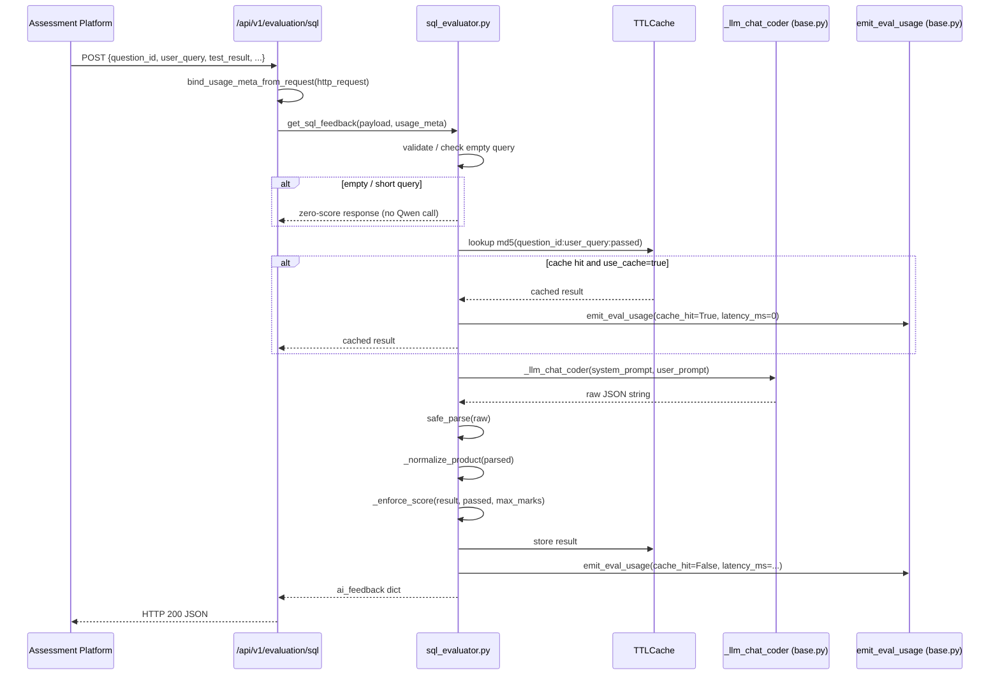

# Design Document: SQL AI Evaluation

## Overview

The SQL AI Evaluation feature adds a `POST /api/v1/evaluation/sql` endpoint to the model service. It follows the exact same pattern as the existing DSA and AIML evaluators — using the Qwen coder model via `_llm_chat_coder`, TTL caching via `cachetools.TTLCache`, safe JSON parsing via `safe_parse`, and billing via `emit_eval_usage`.

The external execution engine (on the assessment platform) already runs the candidate's SQL and sends the execution result to our service. Our service receives that result plus question context, calls Qwen to generate a score and detailed feedback, enforces score floor/cap as a hard post-processing step, and returns the structured `ai_feedback` JSON that the platform stores on the submission document.

### Key Design Decisions

- **No new LLM infrastructure**: reuses `_llm_chat_coder` and `base.py` exactly as DSA/AIML do.
- **Score enforcement is post-processing only**: Qwen is instructed about floors/caps as a hint, but the Python layer enforces them deterministically regardless of what Qwen returns.
- **Reference query is prompt-only**: `reference_query` is sent to Qwen for context but is never included in the response — `answer_log.expected_answer` is always `""`.
- **Criteria redistribution on clamp**: when the overall score is clamped, individual `criteria_scores` are scaled proportionally so their weighted sum always equals the clamped overall score.
- **SQL-specific efficiency language**: O(n) notation is forbidden in the prompt; Qwen must use SQL terms (full table scan, index seek, correlated subquery overhead, etc.).

---

## Architecture



### File Map

| File | Role |
|------|------|
| `backend/model_app/competencies/sql/eval_schema.py` | Pydantic request (`SQLEvaluationRequest`) and response (`SQLAIFeedback`) models |
| `backend/model_app/evaluation/sql_evaluator.py` | Main evaluator: cache, prompt construction, Qwen call, normalization, score enforcement, fallback |
| `backend/model_app/api/routes/evaluation.py` | Add `@router.post("/sql")` alongside existing `/dsa` and `/aiml` routes |

---

## Components and Interfaces

### `eval_schema.py` — Pydantic Models

**`TestResult`** (nested object inside request):
```python
class TestResult(BaseModel):
    passed: bool
    user_output: str = ""
    expected_output: str = ""
    error: Optional[str] = None
```

**`SQLEvaluationRequest`**:
```python
class SQLEvaluationRequest(BaseModel):
    question_id: str
    question_description: str
    user_query: str
    reference_query: str
    max_marks: float
    schemas: dict                        # table definitions
    test_result: TestResult
    order_sensitive: bool = False
    difficulty: str = "medium"
    section: str = ""
    use_cache: bool = True
```

**`CriterionScore`** (nested in response):
```python
class CriterionScore(BaseModel):
    score: float
    weight: float
    feedback: str
```

**`SQLAIFeedback`** — mirrors the full `ai_feedback` contract from Requirement 5:
```python
class SQLAIFeedback(BaseModel):
    question_id: str
    section: str
    question_type: Literal["SQL"] = "SQL"
    score: float
    max_marks: float
    percentage: float
    criteria_scores: dict[str, CriterionScore]
    feedback: dict          # summary, strengths, weaknesses, detailed_analysis, suggestions
    answer_log: dict        # submitted_answer, expected_answer="", key_points_covered, ...
    areas_of_improvement: list[dict]
    benchmarking: dict      # compared_to_peers, percentile, industry_standard
    insights: dict          # approach_quality, edge_case_handling, alternative_solutions
    flags: dict             # plagiarism_risk, ai_generated_risk, incomplete_answer, ...
    evaluation_version: str = "2.1.0"
    ai_generated: bool = True
```

### `sql_evaluator.py` — Public Interface

```python
def get_sql_feedback(*, payload: dict, usage_meta: dict | None) -> dict:
    """
    Main entry point called by the route handler.
    Accepts raw dict payload (validated by Pydantic at route level).
    Returns ai_feedback dict matching SQLAIFeedback schema.
    """
```

Internal helpers (all module-private):

| Function | Purpose |
|----------|---------|
| `_build_user_prompt(req)` | Constructs the user message with truncation |
| `_enforce_score(result, passed, max_marks)` | Applies floor/cap + criteria redistribution |
| `_normalize_product(raw, max_marks)` | Fills missing keys, clamps values |
| `_empty_response(req)` | Zero-score response for empty/short queries |
| `_fallback_response(req)` | Deterministic fallback when Qwen fails |

### Route Handler Addition (`evaluation.py`)

```python
@router.post("/sql")
async def evaluate_sql(
    http_request: Request,
    payload: SQLEvaluationRequest,
):
    usage_meta = bind_usage_meta_from_request(http_request)
    return get_sql_feedback(payload=payload.model_dump(), usage_meta=usage_meta)
```

Using the Pydantic model directly (instead of `dict = Body(...)`) gives free 422 validation — consistent with Requirement 1.3.

---

## Data Models

### Cache

```python
_cache = TTLCache(maxsize=500, ttl=3600)
```

Cache key construction:
```python
cache_key = hashlib.md5(
    f"{question_id}:{user_query}:{passed}".encode()
).hexdigest()
```

The `passed` boolean is included in the key so that if the execution engine re-runs a query and the verdict changes, the cache does not serve a stale result.

### System Prompt (SQL-specific)

```
You are a strict SQL evaluator. Return ONLY minified JSON — no markdown, no code fences, no extra keys.

Output schema (all keys required):
{
  "score": <float, 0 to max_marks>,
  "criteria_scores": {
    "correctness":           {"score": <float>, "weight": 0.40, "feedback": "<string>"},
    "efficiency":            {"score": <float>, "weight": 0.25, "feedback": "<string>"},
    "best_practices":        {"score": <float>, "weight": 0.15, "feedback": "<string>"},
    "edge_cases":            {"score": <float>, "weight": 0.10, "feedback": "<string>"},
    "alternative_solutions": {"score": <float>, "weight": 0.10, "feedback": "<string>"}
  },
  "feedback": {
    "summary": "<2 sentences>",
    "strengths": ["<string>"],
    "weaknesses": ["<string>"],
    "detailed_analysis": "<string>",
    "suggestions": ["<string>"]
  },
  "answer_log": {
    "key_points_covered": ["<string>"],
    "key_points_missed": ["<string>"],
    "partial_credit_reasoning": "<string>"
  },
  "areas_of_improvement": [
    {
      "skill": "<string>",
      "current_level": "<string>",
      "gap_analysis": "<string>",
      "priority": "<High|Medium|Low>",
      "improvement_suggestions": [
        {"suggestion": "<string>", "resources": [], "practice_exercises": [], "estimated_time": "<string>"}
      ]
    }
  ],
  "benchmarking": {"compared_to_peers": "<string>", "percentile": <float 0-100>, "industry_standard": "<string>"},
  "insights": {"approach_quality": "<string>", "edge_case_handling": "<string>", "alternative_solutions": ["<string>"]},
  "flags": {
    "plagiarism_risk": "<Low|Medium|High>",
    "ai_generated_risk": "<Low|Medium|High>",
    "confidence_level": <float 0-1>
  }
}

Evaluation criteria weights:
- correctness (40%): does the result set match expected output (considering order_sensitive flag)
- efficiency (25%): index usage, full table scans, window functions vs correlated subqueries, join order
- best_practices (15%): aliases, formatting, readability, SQL conventions, avoiding SELECT *
- edge_cases (10%): NULL handling, empty result sets, boundary conditions, type coercion
- alternative_solutions (10%): better approaches using CTEs, window functions, set operations

IMPORTANT — efficiency language: use SQL-specific terms ONLY.
FORBIDDEN: O(n), O(n²), O(log n), Big-O notation of any kind.
USE INSTEAD: "full table scan", "index seek", "index scan", "correlated subquery overhead",
"hash join", "nested loop join", "sort-merge join", "covering index", "N+1 query pattern".

Score floor/cap (hint — will be enforced by post-processing):
- If passed=true: score should be at least 80% of max_marks
- If passed=false: score should be at most 50% of max_marks

Be concise and specific. No praise fluff. Output must end with '}' and contain nothing after it.
```

### User Prompt Construction

```python
def _build_user_prompt(req: dict) -> str:
    desc = (req["question_description"] or "")[:1000]
    user_q = req["user_query"]
    ref_q = req["reference_query"]
    schemas_str = json.dumps(req.get("schemas") or {}, indent=2)[:800]
    user_out = (req["test_result"]["user_output"] or "")[:500]
    exp_out = (req["test_result"]["expected_output"] or "")[:500]
    error = (req["test_result"].get("error") or "")[:300]
    passed = req["test_result"]["passed"]

    return (
        f"question_description: {desc}\n"
        f"difficulty: {req.get('difficulty', 'medium')}\n"
        f"order_sensitive: {req.get('order_sensitive', False)}\n"
        f"max_marks: {req['max_marks']}\n\n"
        f"schemas:\n{schemas_str}\n\n"
        f"candidate_query:\n{user_q}\n\n"
        f"reference_query (for context only, do not expose):\n{ref_q}\n\n"
        f"test_result:\n"
        f"  passed: {passed}\n"
        f"  user_output: {user_out}\n"
        f"  expected_output: {exp_out}\n"
        f"  error: {error or 'None'}\n\n"
        f"Return ONLY the minified JSON described in the system prompt."
    )
```

Truncation limits:
| Field | Limit |
|-------|-------|
| `question_description` | 1000 chars |
| `schemas` (JSON-serialized) | 800 chars |
| `user_output` | 500 chars |
| `expected_output` | 500 chars |
| `error` | 300 chars |

### Score Enforcement Algorithm

```python
def _enforce_score(result: dict, passed: bool, max_marks: float) -> dict:
    raw_score = float(result.get("score") or 0)

    # 1. Apply floor / cap
    if passed:
        score = max(raw_score, max_marks * 0.8)
    else:
        score = min(raw_score, max_marks * 0.5)

    # Clamp to [0, max_marks]
    score = max(0.0, min(score, max_marks))

    # 2. Recompute percentage
    percentage = round((score / max_marks) * 100, 2) if max_marks > 0 else 0.0

    # 3. Redistribute criteria_scores proportionally
    criteria = result.get("criteria_scores") or {}
    weights = {
        "correctness": 0.40,
        "efficiency": 0.25,
        "best_practices": 0.15,
        "edge_cases": 0.10,
        "alternative_solutions": 0.10,
    }
    weighted_sum = sum(
        float((criteria.get(k) or {}).get("score") or 0) * w
        for k, w in weights.items()
    )
    if weighted_sum > 0 and abs(weighted_sum - score) > 0.01:
        scale = score / weighted_sum
        for k in weights:
            if k in criteria and isinstance(criteria[k], dict):
                old = float(criteria[k].get("score") or 0)
                max_criterion = max_marks * weights[k]
                criteria[k]["score"] = round(
                    max(0.0, min(old * scale, max_criterion)), 4
                )
    elif weighted_sum == 0 and score > 0:
        # Distribute score proportionally by weight when all criteria are 0
        for k, w in weights.items():
            if k not in criteria or not isinstance(criteria.get(k), dict):
                criteria[k] = {"score": 0.0, "weight": w, "feedback": ""}
            criteria[k]["score"] = round(score * w, 4)

    result["score"] = round(score, 4)
    result["percentage"] = percentage
    result["criteria_scores"] = criteria
    return result
```

### Normalization Logic (`_normalize_product`)

Mirrors `dsa_evaluator._normalize_product` but for the SQL contract:

1. Start from `_empty_response_dict()` (all keys with safe defaults).
2. Copy only known keys from `raw` into the base dict.
3. Clamp `score` to `[0, max_marks]`.
4. For each criterion in `criteria_scores`: ensure dict shape `{score, weight, feedback}`, clamp score to `[0, max_marks * weight]`.
5. Ensure `feedback` is a dict with keys `summary`, `strengths`, `weaknesses`, `detailed_analysis`, `suggestions` — default to `""` / `[]`.
6. Ensure `answer_log` has all required keys; force `expected_answer = ""`.
7. Ensure `areas_of_improvement` is a list; for each item ensure required keys (`skill`, `current_level`, `gap_analysis`, `priority`, `improvement_suggestions`) default to `""` / `[]`.
8. Ensure `benchmarking.percentile` is a float clamped to `[0.0, 100.0]`.
9. Ensure `flags.plagiarism_risk` and `flags.ai_generated_risk` are one of `{"Low", "Medium", "High"}` — default `"Low"`.
10. Force `ai_generated = True`, `question_type = "SQL"`, `evaluation_version = "2.1.0"`.

### Fallback Scoring Logic

Applied when Qwen raises an exception or `safe_parse` returns `parse_error=True`:

```python
def _fallback_response(req: dict) -> dict:
    passed = req["test_result"]["passed"]
    max_marks = float(req["max_marks"])
    score = max_marks * 0.8 if passed else max_marks * 0.3
    percentage = round((score / max_marks) * 100, 2) if max_marks > 0 else 0.0
    # ... build full contract dict with score, criteria distributed by weight,
    # flags.requires_human_review=True,
    # feedback.summary="Automated scoring applied. Human review recommended."
```

Fallback score rules:
| Condition | Score |
|-----------|-------|
| `passed=True` | `max_marks * 0.8` |
| `passed=False` | `max_marks * 0.3` |

### Billing Integration Points

```python
# Cache hit
emit_eval_usage(usage_meta, "sql_evaluation", latency_ms=0, cache_hit=True)

# Successful Qwen call
start = time.time()
raw, _, _ = _llm_chat_coder(messages=messages, temperature=0.0, max_tokens=700)
latency_ms = (time.time() - start) * 1000
emit_eval_usage(usage_meta, "sql_evaluation", latency_ms=latency_ms, cache_hit=False)

# Error / fallback
emit_eval_usage(usage_meta, "sql_evaluation", latency_ms=0, status="error", error_detail=str(e))
```

---

## Correctness Properties

*A property is a characteristic or behavior that should hold true across all valid executions of a system — essentially, a formal statement about what the system should do. Properties serve as the bridge between human-readable specifications and machine-verifiable correctness guarantees.*

### Property 1: Missing required fields yield 422

*For any* subset of the required fields `{question_id, question_description, user_query, reference_query, max_marks, schemas, test_result}` that omits at least one, a POST to `/api/v1/evaluation/sql` SHALL return HTTP 422.

**Validates: Requirements 1.3**

---

### Property 2: Valid requests always return HTTP 200

*For any* well-formed `SQLEvaluationRequest` (all required fields present, valid types), the endpoint SHALL return HTTP 200.

**Validates: Requirements 1.4**

---

### Property 3: Cache key is deterministic

*For any* `(question_id, user_query, passed)` triple, the computed cache key SHALL equal `md5(f"{question_id}:{user_query}:{passed}".encode()).hexdigest()` — identical inputs always produce the same key, different inputs produce different keys with overwhelming probability.

**Validates: Requirements 2.2**

---

### Property 4: Caching round-trip

*For any* valid request with `use_cache=true`, submitting the same request twice SHALL return identical results on the second call without invoking Qwen a second time.

**Validates: Requirements 2.3**

---

### Property 5: Score floor/cap enforcement

*For any* `(raw_score, max_marks, passed)` triple where `max_marks > 0`, after `_enforce_score` is applied:
- If `passed=True`: `result.score >= max_marks * 0.8`
- If `passed=False`: `result.score <= max_marks * 0.5`
- In all cases: `0 <= result.score <= max_marks`

**Validates: Requirements 4.1, 4.2, 4.3**

---

### Property 6: Percentage is always consistent with score

*For any* `(score, max_marks)` pair where `max_marks > 0`, after enforcement `result.percentage == round((result.score / max_marks) * 100, 2)`.

**Validates: Requirements 4.4**

---

### Property 7: Criteria weighted sum equals overall score

*For any* result dict after `_enforce_score`, the weighted sum of `criteria_scores` SHALL equal `result.score`:
`sum(criteria_scores[k].score * weight[k] for k in criteria) ≈ result.score` (within floating-point tolerance).

**Validates: Requirements 4.5**

---

### Property 8: Response always matches contract schema

*For any* valid `SQLEvaluationRequest`, the response dict SHALL contain all required top-level keys with correct types as defined in Requirement 5.1.

**Validates: Requirements 5.1**

---

### Property 9: expected_answer is always empty string

*For any* valid request, `response["answer_log"]["expected_answer"] == ""`.

**Validates: Requirements 5.2**

---

### Property 10: submitted_answer equals user_query

*For any* valid request, `response["answer_log"]["submitted_answer"] == request.user_query`.

**Validates: Requirements 5.3**

---

### Property 11: Whitespace queries set incomplete_answer flag

*For any* string composed entirely of whitespace characters (including empty string), the response SHALL have `flags.incomplete_answer == True` and `score == 0`.

**Validates: Requirements 5.4, 7.1, 7.2**

---

### Property 12: Fallback sets requires_human_review

*For any* request where Qwen raises an exception or returns unparseable output, `flags.requires_human_review == True`.

**Validates: Requirements 5.5, 6.1**

---

### Property 13: Fallback scores are deterministic

*For any* `max_marks > 0`, the fallback function SHALL produce:
- `score == max_marks * 0.8` when `passed=True`
- `score == max_marks * 0.3` when `passed=False`

**Validates: Requirements 6.2, 6.3**

---

### Property 14: Normalizer fills all missing keys

*For any* dict input (including empty dict `{}`), `_normalize_product(raw, max_marks)` SHALL return a dict containing every key required by the `SQLAIFeedback` contract with type-correct defaults.

**Validates: Requirements 9.1, 9.2**

---

### Property 15: Normalizer clamps scores to valid ranges

*For any* dict input with arbitrary numeric values, after normalization:
- `result["score"]` is in `[0, max_marks]`
- For each criterion `k`: `result["criteria_scores"][k]["score"]` is in `[0, max_marks * weight[k]]`
- `result["benchmarking"]["percentile"]` is in `[0.0, 100.0]`

**Validates: Requirements 9.3, 9.4, 9.7**

---

### Property 16: Risk flags are valid enum values

*For any* dict input, after normalization `flags.plagiarism_risk` and `flags.ai_generated_risk` are each one of `{"Low", "Medium", "High"}`.

**Validates: Requirements 9.6**

---

## Error Handling

| Scenario | Behavior |
|----------|----------|
| Missing required field | Pydantic raises `ValidationError` → FastAPI returns HTTP 422 automatically |
| `user_query` empty or < 10 non-whitespace chars | Return zero-score response immediately, no Qwen call |
| Qwen raises exception | Log warning, apply `_fallback_response`, emit usage with `status="error"` |
| `safe_parse` returns `parse_error=True` | Same as Qwen exception — apply fallback |
| `max_marks <= 0` | Treat as `max_marks = 1.0` to avoid division-by-zero in percentage calculation |
| Cache miss + `use_cache=false` | Always call Qwen, do not read or write cache |

---

## Testing Strategy

### Unit Tests (example-based)

- Valid request → HTTP 200 with all required response keys
- Missing each required field → HTTP 422
- `use_cache=false` → Qwen called on every request (mock Qwen)
- Qwen exception → fallback response with `requires_human_review=True`
- `safe_parse` returns `parse_error=True` → fallback applied
- `emit_eval_usage` called with correct `route="sql_evaluation"` argument
- `answer_log.expected_answer` is always `""`
- `answer_log.submitted_answer` equals `user_query`

### Property-Based Tests

Uses **Hypothesis** (Python PBT library). Each property test runs a minimum of **100 iterations**.

Tag format: `# Feature: sql-evaluation, Property {N}: {property_text}`

| Property | Test Description |
|----------|-----------------|
| P1 | Generate random subsets of required fields missing ≥1 → assert 422 |
| P2 | Generate random valid `SQLEvaluationRequest` dicts → assert 200 |
| P3 | Generate random `(question_id, user_query, passed)` → assert cache key equals md5 formula |
| P4 | Generate valid request, submit twice with `use_cache=true` → assert Qwen called once |
| P5 | Generate random `(raw_score, max_marks, passed)` → assert floor/cap invariants hold after `_enforce_score` |
| P6 | Generate random `(score, max_marks)` → assert `percentage == round((score/max_marks)*100, 2)` |
| P7 | Generate random criteria scores + overall score → assert weighted sum ≈ overall score after enforcement |
| P8 | Generate valid requests → assert response contains all contract keys |
| P9 | Generate valid requests → assert `answer_log.expected_answer == ""` |
| P10 | Generate valid requests with random `user_query` → assert `submitted_answer == user_query` |
| P11 | Generate whitespace-only strings → assert `incomplete_answer=True` and `score=0` |
| P12 | Generate valid requests, mock Qwen to raise → assert `requires_human_review=True` |
| P13 | Generate random `max_marks > 0` → assert fallback scores match formula |
| P14 | Generate random dicts (including `{}`) → assert all contract keys present after `_normalize_product` |
| P15 | Generate random dicts with arbitrary scores → assert all scores clamped to valid ranges |
| P16 | Generate random dicts with arbitrary risk strings → assert risk flags are in `{"Low","Medium","High"}` |

### Integration Tests

- End-to-end: POST to `/api/v1/evaluation/sql` with a realistic payload → verify response structure and score enforcement
- Billing: verify `emit_eval_usage` is called with `route="sql_evaluation"` on cache hit, Qwen call, and error paths (1-2 examples each)
